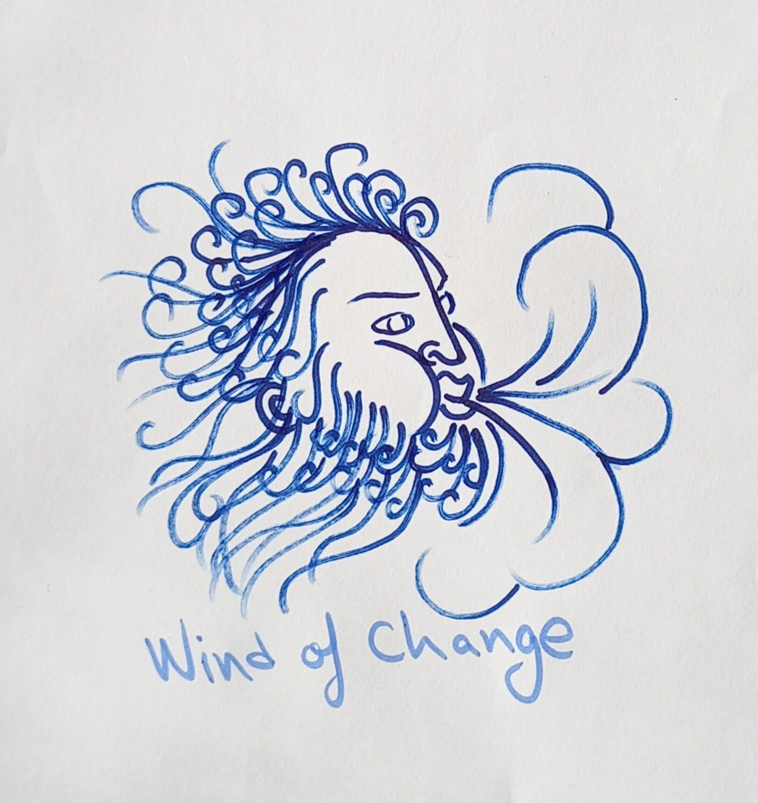
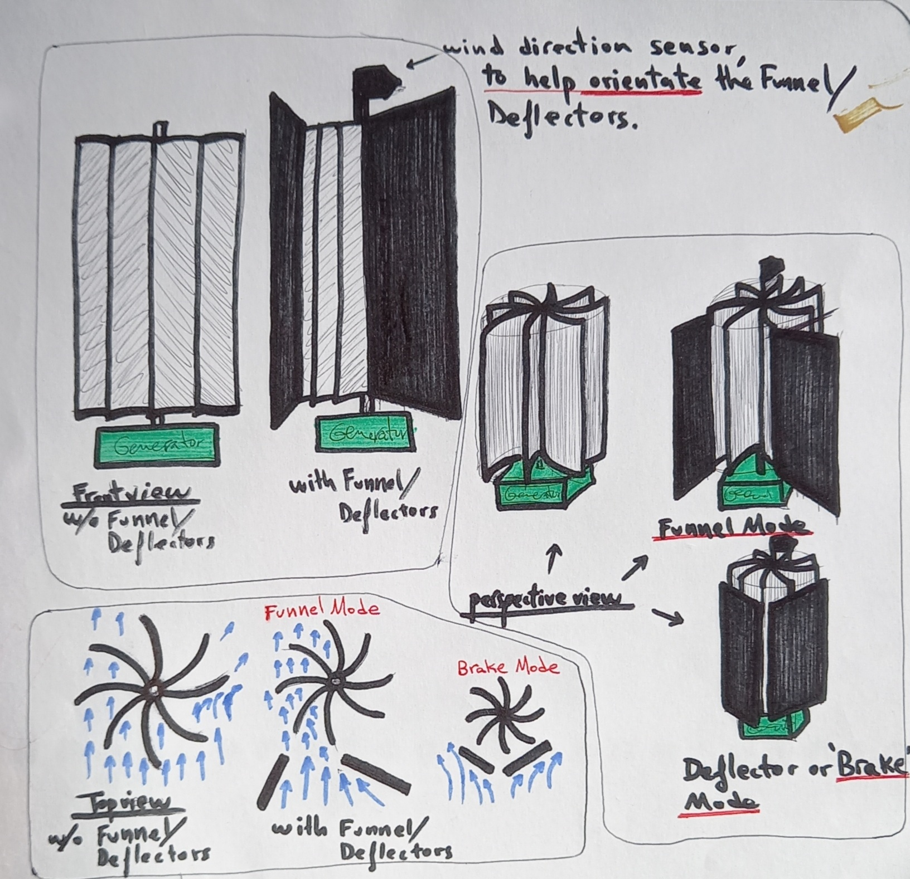

# windOfChange
Idea for developing a simple Vertical Axis Wind Turbine (VAWT).
I would like to see the democratization of the use of renewable energy from the wind; and the open source philosophy spreading to all engineering disciplines.

# Development
This project is not maintained.

# Main Concept
The main idea is to use a pair of deflectors that can be configured to either:
- **Speed it up:** the air intake and speed can be increased, by setting the deflectors in such a position that they funnel the wind into the side of the turbine that moves with the wind, and blocking the side of the turbine that moves against the wind.
- **Slow or stop it:** the air intake and speed can be reduced, even stopped, by setting the deflectors in such a position that they reduce or block all the air intake.

